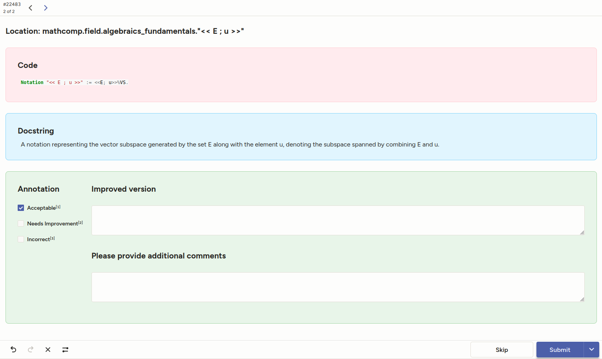
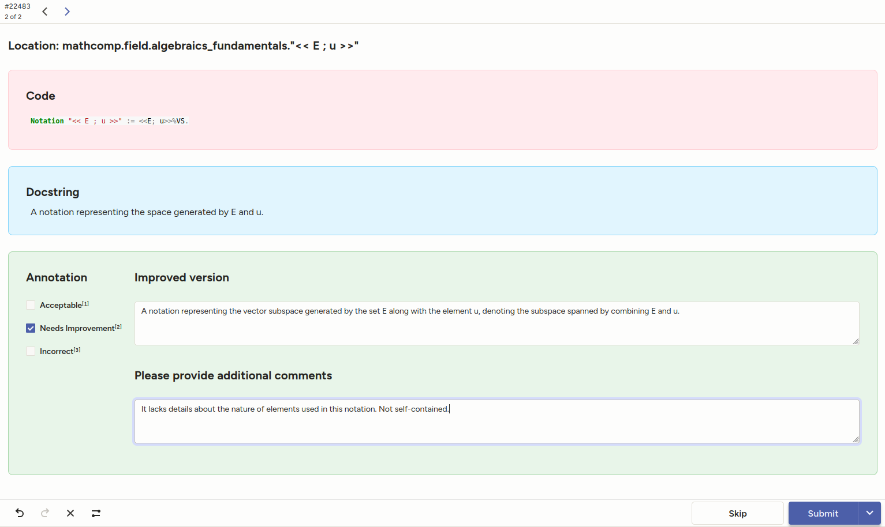

# LLM4Docq
Collaborative project to add docstrings to MathComp.

_All informations are updated once every 15 minutes_

  <em>Current state of the project</em>

 

  <em>Thanks to our contributors</em>

Want more details? Jump to [progress](#progress) to see section-by-section status.

## Introduction
**LLM4Docq** is a collaborative research project with three main objectives:

1. **Docstring enrichment for MathComp:**  
   We aim to add detailed docstrings to all elements of the MathComp library:
   - Definitions: 3,067
   - Lemmas: 14,925
   - Notations: 3,386
   - Theorems: 61
   - Facts: 654
   - Fixpoints: 140
   - Records: 256

2. **Embedding-based retrieval system:**  
   A VSCode plugin for Rocq users, enabling retrieval from natural language query.

3. **Annotator–formalizer models:**  
   - Generate a docstring from a formal statement and its context.
   - Reconstruct a formal statement from a docstring and context.

To gather the underlying dataset, we use an iterative process:
1. LLMs generate initial docstrings.
2. Experts review and give feedback on a subpart of the generated docstrings.
3. Unseen or refused entries are regenerated with new instructions based on previous feedback.

### Progress

Algebra

Boot

Character

Field

Fingroup

Order

Solvable

Test Suite

## How to contribute
1. **Request access** to join the project.
2. **Pick a source file:**  
   Each file is managed as a separate project in our collaborative platform (Label Studio). Find one in the [project hierarchy](#project-hierarchy) below.
3. **Annotate entries:**  
   For each entry, you can:
   - **Validate annotation** (mandatory):  
     - Acceptable
     - Needs Improvement
     - Incorrect
   - **Suggest improvements** (if needed).
   - **Comment** for additional feedback.
   - **Skip** if unsure.
   - **Submit** your work.

### Complete the entry

## How to Contribute

1. **Request access** to join the project.
2. **Pick a source file:**  
   Each file is managed as a separate project in our collaborative platform (Label Studio). Find one in the [project hierarchy](#project-hierarchy) below.
3. **For each entry, choose one of the following interactions:**

### Entry Interactions

- **Annotate** (required):  
  Review the proposed docstring and select its status:
  - **Acceptable:** The docstring is correct and sufficiently detailed.
  - **Needs Improvement:** The docstring is mostly correct but could be clearer or more precise.
  - **Incorrect:** The docstring is wrong or irrelevant.

- **Suggest an improved version:**  
  If the annotation is "Needs Improvement" or "Incorrect", provide a better docstring.

- **Add comments:**  
  Share additional feedback, clarifications, or suggestions for future improvements.

- **Skip:**  
  If you are unsure how to annotate the entry, you can skip it.

- **Submit:**  
  Submit your review once you have finished annotating or commenting.

**See below for some examples:**

#### Acceptable case

The docstring is correct and complete.
Select "Acceptable" and submit.

#### Needs Improvement case

The docstring is mostly correct, but could be improved or clarified.
Select "Needs Improvement”, suggest a better version and leave a comment.

#### Incorrect case

The docstring is incorrect or unrelated to the code.
Select "Incorrect" and provide a corrected version and comment.

### Project hierarchy

Below is the overall hierarchy. To contribute, click on a source file in an expandable section.

Algebra

* num_theory
    * [numdomain](http://51.38.234.127:8080/projects/34/data?tab=4&labeling=1)
    * [numfield](http://51.38.234.127:8080/projects/28/data?tab=4&labeling=1)
    * [orderedzmod](http://51.38.234.127:8080/projects/84/data?tab=4&labeling=1)
    * [ssrnum](http://51.38.234.127:8080/projects/75/data?tab=4&labeling=1)
* [archimedean](http://51.38.234.127:8080/projects/17/data?tab=4&labeling=1)
* [countalg](http://51.38.234.127:8080/projects/82/data?tab=4&labeling=1)
* [finalg](http://51.38.234.127:8080/projects/73/data?tab=4&labeling=1)
* [fraction](http://51.38.234.127:8080/projects/50/data?tab=4&labeling=1)
* [intdiv](http://51.38.234.127:8080/projects/39/data?tab=4&labeling=1)
* [interval](http://51.38.234.127:8080/projects/20/data?tab=4&labeling=1)
* [interval_inference](http://51.38.234.127:8080/projects/77/data?tab=4&labeling=1)
* [matrix](http://51.38.234.127:8080/projects/11/data?tab=4&labeling=1)
* [mxalgebra](http://51.38.234.127:8080/projects/48/data?tab=4&labeling=1)
* [mxpoly](http://51.38.234.127:8080/projects/15/data?tab=4&labeling=1)
* [mxred](http://51.38.234.127:8080/projects/31/data?tab=4&labeling=1)
* [poly](http://51.38.234.127:8080/projects/12/data?tab=4&labeling=1)
* [polyXY](http://51.38.234.127:8080/projects/61/data?tab=4&labeling=1)
* [polydiv](http://51.38.234.127:8080/projects/65/data?tab=4&labeling=1)
* [qpoly](http://51.38.234.127:8080/projects/6/data?tab=4&labeling=1)
* [rat](http://51.38.234.127:8080/projects/43/data?tab=4&labeling=1)
* [ring_quotient](http://51.38.234.127:8080/projects/79/data?tab=4&labeling=1)
* [sesquilinear](http://51.38.234.127:8080/projects/55/data?tab=4&labeling=1)
* [spectral](http://51.38.234.127:8080/projects/66/data?tab=4&labeling=1)
* [ssralg](http://51.38.234.127:8080/projects/8/data?tab=4&labeling=1)
* [ssrint](http://51.38.234.127:8080/projects/57/data?tab=4&labeling=1)
* [vector](http://51.38.234.127:8080/projects/16/data?tab=4&labeling=1)
* [zmodp](http://51.38.234.127:8080/projects/58/data?tab=4&labeling=1)

Boot

* [bigop](http://51.38.234.127:8080/projects/46/data?tab=4&labeling=1)
* [binomial](http://51.38.234.127:8080/projects/41/data?tab=4&labeling=1)
* [choice](http://51.38.234.127:8080/projects/69/data?tab=4&labeling=1)
* [div](http://51.38.234.127:8080/projects/26/data?tab=4&labeling=1)
* [eqtype](http://51.38.234.127:8080/projects/5/data?tab=4&labeling=1)
* [finfun](http://51.38.234.127:8080/projects/71/data?tab=4&labeling=1)
* [fingraph](http://51.38.234.127:8080/projects/60/data?tab=4&labeling=1)
* [finset](http://51.38.234.127:8080/projects/42/data?tab=4&labeling=1)
* [fintype](http://51.38.234.127:8080/projects/52/data?tab=4&labeling=1)
* [generic_quotient](http://51.38.234.127:8080/projects/80/data?tab=4&labeling=1)
* [monoid](http://51.38.234.127:8080/projects/45/data?tab=4&labeling=1)
* [nmodule](http://51.38.234.127:8080/projects/3/data?tab=4&labeling=1)
* [path](http://51.38.234.127:8080/projects/27/data?tab=4&labeling=1)
* [prime](http://51.38.234.127:8080/projects/59/data?tab=4&labeling=1)
* [seq](http://51.38.234.127:8080/projects/23/data?tab=4&labeling=1)
* [ssrAC](http://51.38.234.127:8080/projects/83/data?tab=4&labeling=1)
* [ssrbool](http://51.38.234.127:8080/projects/74/data?tab=4&labeling=1)
* [ssrfun](http://51.38.234.127:8080/projects/93/data?tab=4&labeling=1)
* [ssrnat](http://51.38.234.127:8080/projects/21/data?tab=4&labeling=1)
* [ssrnotations](http://51.38.234.127:8080/projects/92/data?tab=4&labeling=1)
* [tuple](http://51.38.234.127:8080/projects/32/data?tab=4&labeling=1)

Character

* [character](http://51.38.234.127:8080/projects/10/data?tab=4&labeling=1)
* [classfun](http://51.38.234.127:8080/projects/44/data?tab=4&labeling=1)
* [inertia](http://51.38.234.127:8080/projects/38/data?tab=4&labeling=1)
* [integral_char](http://51.38.234.127:8080/projects/95/data?tab=4&labeling=1)
* [mxabelem](http://51.38.234.127:8080/projects/22/data?tab=4&labeling=1)
* [mxrepresentation](http://51.38.234.127:8080/projects/4/data?tab=4&labeling=1)
* [vcharacter](http://51.38.234.127:8080/projects/54/data?tab=4&labeling=1)

Field

* [algC](http://51.38.234.127:8080/projects/37/data?tab=4&labeling=1)
* [algebraics_fundamentals](http://51.38.234.127:8080/projects/98/data?tab=4&labeling=1)
* [algnum](http://51.38.234.127:8080/projects/81/data?tab=4&labeling=1)
* [closed_field](http://51.38.234.127:8080/projects/68/data?tab=4&labeling=1)
* [cyclotomic](http://51.38.234.127:8080/projects/85/data?tab=4&labeling=1)
* [falgebra](http://51.38.234.127:8080/projects/56/data?tab=4&labeling=1)
* [fieldext](http://51.38.234.127:8080/projects/29/data?tab=4&labeling=1)
* [finfield](http://51.38.234.127:8080/projects/67/data?tab=4&labeling=1)
* [galois](http://51.38.234.127:8080/projects/76/data?tab=4&labeling=1)
* [qfpoly](http://51.38.234.127:8080/projects/88/data?tab=4&labeling=1)
* [separable](http://51.38.234.127:8080/projects/49/data?tab=4&labeling=1)

Fingroup

* [action](http://51.38.234.127:8080/projects/1/data?tab=4&labeling=1)
* [automorphism](http://51.38.234.127:8080/projects/87/data?tab=4&labeling=1)
* [fingroup](http://51.38.234.127:8080/projects/2/data?tab=4&labeling=1)
* [gproduct](http://51.38.234.127:8080/projects/47/data?tab=4&labeling=1)
* [morphism](http://51.38.234.127:8080/projects/18/data?tab=4&labeling=1)
* [perm](http://51.38.234.127:8080/projects/40/data?tab=4&labeling=1)
* [presentation](http://51.38.234.127:8080/projects/94/data?tab=4&labeling=1)
* [quotient](http://51.38.234.127:8080/projects/35/data?tab=4&labeling=1)

Order

* [order](http://51.38.234.127:8080/projects/13/data?tab=4&labeling=1)
* [preorder](http://51.38.234.127:8080/projects/9/data?tab=4&labeling=1)

Solvable

* [abelian](http://51.38.234.127:8080/projects/36/data?tab=4&labeling=1)
* [alt](http://51.38.234.127:8080/projects/70/data?tab=4&labeling=1)
* [burnside_app](http://51.38.234.127:8080/projects/33/data?tab=4&labeling=1)
* [center](http://51.38.234.127:8080/projects/25/data?tab=4&labeling=1)
* [commutator](http://51.38.234.127:8080/projects/72/data?tab=4&labeling=1)
* [cyclic](http://51.38.234.127:8080/projects/14/data?tab=4&labeling=1)
* [extraspecial](http://51.38.234.127:8080/projects/53/data?tab=4&labeling=1)
* [extremal](http://51.38.234.127:8080/projects/91/data?tab=4&labeling=1)
* [finmodule](http://51.38.234.127:8080/projects/89/data?tab=4&labeling=1)
* [frobenius](http://51.38.234.127:8080/projects/63/data?tab=4&labeling=1)
* [gfunctor](http://51.38.234.127:8080/projects/97/data?tab=4&labeling=1)
* [gseries](http://51.38.234.127:8080/projects/51/data?tab=4&labeling=1)
* [hall](http://51.38.234.127:8080/projects/90/data?tab=4&labeling=1)
* [jordanholder](http://51.38.234.127:8080/projects/7/data?tab=4&labeling=1)
* [maximal](http://51.38.234.127:8080/projects/19/data?tab=4&labeling=1)
* [nilpotent](http://51.38.234.127:8080/projects/64/data?tab=4&labeling=1)
* [pgroup](http://51.38.234.127:8080/projects/24/data?tab=4&labeling=1)
* [primitive_action](http://51.38.234.127:8080/projects/62/data?tab=4&labeling=1)
* [sylow](http://51.38.234.127:8080/projects/96/data?tab=4&labeling=1)

Test Suite

* [test_guard](http://51.38.234.127:8080/projects/86/data?tab=4&labeling=1)
* [test_intro_rw](http://51.38.234.127:8080/projects/78/data?tab=4&labeling=1)
* [test_ssrAC](http://51.38.234.127:8080/projects/30/data?tab=4&labeling=1)

